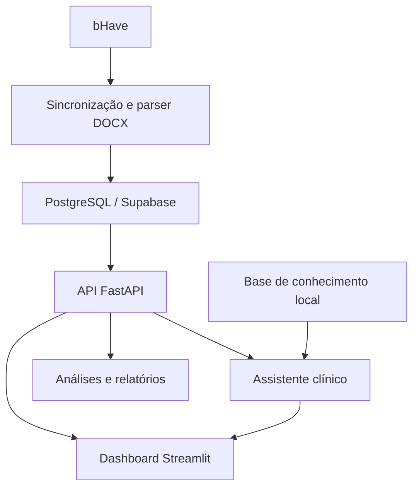

# Skinner 2.0

Plataforma local de **análise de dados clínicos em ABA**, criada para transformar registros da plataforma bHave em indicadores, visualizações e relatórios de apoio à tomada de decisão.

> **Status:** protótipo de portfólio em desenvolvimento. A versão atual **não deve ser utilizada em produção nem receber dados reais de pacientes** sem revisão adicional de segurança, privacidade, controle de acesso e conformidade com a LGPD.

## O problema

Registros clínicos ganham valor quando podem responder perguntas práticas:

- O desempenho está avançando?
- Há estabilidade ou muita variabilidade?
- O critério configurado foi alcançado em sessões distintas?
- Quais alvos precisam ser revistos?
- Como apresentar essas informações de forma clara para equipes e gestores?

O Skinner 2.0 organiza esse fluxo em uma aplicação que integra coleta, tratamento, análise descritiva, visualização e geração de documentos.

## Funcionalidades atuais

- Sincronização de programas, alvos e comportamentos interferentes a partir da bHave.
- Organização dos registros em banco PostgreSQL.
- Dashboard interativo desenvolvido com Streamlit e Plotly.
- Análise de independência, ajuda, erros, nível, tendência e variabilidade.
- Comparação entre linha de base e intervenção.
- Acompanhamento do progresso até critérios de desempenho configuráveis.
- Visualizações por programa e por alvo, incluindo séries temporais, composição de respostas, heatmaps e exposição a oportunidades.
- Resumo descritivo de comportamentos interferentes, sem atribuição automática de função.
- Geração de relatórios PEI personalizados, trimestrais e anuais em DOCX.
- Módulo de avaliação ABLLS-R com registro de pontuações e exportação em PDF/CSV.
- Assistente clínico com busca em base de conhecimento local e suporte opcional de modelos de IA.
- API REST em FastAPI para consulta dos dados e dos módulos de avaliação.

## Como as análises são tratadas

O projeto procura evitar interpretações que os dados não sustentam:

- ausência de registro não é tratada como ausência de comportamento;
- médias ponderadas só são calculadas quando existe um número real de oportunidades;
- o critério de desempenho considera datas distintas de coleta;
- nível, tendência e variabilidade são apresentados separadamente;
- contagem e taxa não são tratadas como medidas equivalentes;
- padrões observados não são apresentados como prova de causalidade;
- hipóteses funcionais exigem dados adequados de antecedentes, respostas e consequências.

## Arquitetura



## Tecnologias

| Camada | Tecnologias |
| --- | --- |
| Linguagem e análise | Python, pandas, NumPy |
| Interface e visualização | Streamlit, Plotly, Matplotlib |
| API | FastAPI, Pydantic, Uvicorn |
| Persistência | PostgreSQL/Supabase, SQLAlchemy, Alembic |
| Documentos | python-docx, openpyxl, ReportLab, pypdf |
| IA e recuperação de conhecimento | Gemini e provedores opcionais compatíveis; busca local em Markdown/PDF |
| Qualidade | pytest e testes unitários das regras clínicas |

## Estrutura do repositório

```text
skinner-2.0/
├── app/
│   ├── data/                  # modelos e acesso ao banco
│   ├── services/              # análises, regras do PEI, documentos e IA
│   └── web/                   # dashboard, cliente da API e módulo ABLLS-R
├── alembic/                   # migrações do banco
├── dados_clinica/             # base local; dados reais não devem ser versionados
├── docs/                      # fundamentação e documentação técnica
├── scripts/                   # utilitários de exportação e indexação
├── tests/                     # testes automatizados
├── api.py                     # API FastAPI
├── main.py                    # sincronização com a bHave
├── .env.example               # exemplo de configuração sem segredos
└── requirements.lock.txt      # dependências validadas
```

## Pré-requisitos

- Python 3.13, versão usada para gerar o arquivo de dependências fixadas.
- PostgreSQL ou projeto Supabase compatível.
- Credenciais válidas da bHave, caso a sincronização seja utilizada.
- Um arquivo de template DOCX para a geração do PEI.
- Chave de um provedor de IA somente se o assistente generativo for utilizado.

Sem acesso à bHave e a um banco configurado, o sistema ainda não oferece um modo de demonstração completo. A inclusão de dados totalmente sintéticos é uma melhoria planejada.

## Instalação local

### 1. Clone o repositório

```bash
git clone https://github.com/gabrielanselmorec-lang/skinner-2.0.git
cd skinner-2.0
```

### 2. Crie e ative o ambiente virtual

**Windows / PowerShell**

```powershell
py -3.13 -m venv .venv
.\.venv\Scripts\Activate.ps1
```

**Linux ou macOS**

```bash
python3.13 -m venv .venv
source .venv/bin/activate
```

### 3. Instale as dependências

```bash
python -m pip install --upgrade pip
python -m pip install -r requirements.lock.txt
```

### 4. Configure o ambiente

Copie `.env.example` para `.env` e substitua somente os valores necessários ao seu ambiente local. **Nunca publique o arquivo `.env` nem credenciais reais.**

No Windows:

```powershell
Copy-Item .env.example .env
```

No Linux ou macOS:

```bash
cp .env.example .env
```

Variáveis principais:

| Variável | Obrigatória quando | Finalidade |
| --- | --- | --- |
| `DATABASE_URL` | API/dashboard | Conexão com PostgreSQL/Supabase |
| `BHAVE_API_KEY` | sincronização bHave | Chave usada na autenticação |
| `BHAVE_EMAIL` | sincronização bHave | E-mail da conta autorizada |
| `BHAVE_PASSWORD` | sincronização bHave | Senha da conta autorizada |
| `BHAVE_ACCOUNT_ID` | sincronização bHave | Identificador da conta |
| `SKINNER_PATIENT_HASH_SALT` | sincronização/pseudonimização | Segredo local para pseudonimizar identificadores |
| `SKINNER_PEI_TEMPLATE_PATH` | geração do PEI | Caminho local para o template DOCX |
| `SKINNER_API_URL` | opcional | Endereço da API usado pelo dashboard; padrão local `http://127.0.0.1:8000` |

As configurações opcionais de provedores de IA, modelos, limites e diretórios da base de conhecimento estão documentadas no próprio `.env.example`.

### 5. Aplique as migrações do banco

Com `DATABASE_URL` configurada:

```bash
alembic upgrade head
```

A aplicação ainda mantém alguns fallbacks de criação/ajuste de esquema em runtime; removê-los após consolidar completamente as migrações é uma melhoria pendente.

### 6. Inicie a API

```bash
python -m uvicorn api:app --host 127.0.0.1 --port 8000
```

### 7. Inicie o dashboard em outro terminal

```bash
python -m streamlit run app/web/dashboard.py --server.address 127.0.0.1
```

No Windows, também é possível utilizar `iniciar_skinner_2.0.bat`. O inicializador mantém **API e dashboard vinculados a `127.0.0.1`**, evitando exposição automática dos serviços para outras máquinas da rede local.

## Sincronização e base de conhecimento

Para sincronizar dados autorizados da bHave:

```bash
python main.py
```

Para reconstruir o índice da base de conhecimento local:

```bash
python -m app.services.knowledge_index_cli
```

Use na base de conhecimento apenas documentos que você tenha autorização para armazenar e processar. Não inclua prontuários, relatórios identificáveis ou outros materiais sensíveis no repositório.

## Testes

```bash
python -m pytest -q
```

Os testes cobrem regras do PEI, análise clínica, tratamento de datas, geração de documentos, cliente da API e recuperação da base de conhecimento.

## Privacidade, ética e segurança

Este projeto trabalha com uma categoria sensível de dados. Em qualquer uso real:

- utilize apenas dados com base legal e finalidade definida;
- aplique minimização, controle de acesso, criptografia e política de retenção;
- nunca versione planilhas, relatórios, logs ou identificadores reais de pacientes;
- mantenha arquivos clínicos reais somente em armazenamento local/privado autorizado;
- não envie dados clínicos identificáveis a provedores de IA sem autorização e salvaguardas contratuais adequadas;
- trate respostas da IA como apoio, nunca como decisão clínica automática;
- mantenha revisão profissional e registro das fontes utilizadas;
- realize avaliação formal de segurança e conformidade antes de qualquer implantação.

O `.gitignore` bloqueia dados clínicos locais, logs e arquivos de ambiente conhecidos, mas isso **não substitui revisão antes de cada commit**. A pseudonimização reduz exposição, porém não equivale a anonimização irreversível.

## Limitações atuais

- Não há autenticação de usuários ou autorização por perfil na API.
- A configuração ainda depende de credenciais e serviços externos.
- Não existe um conjunto sintético completo para demonstração pública.
- O fluxo de PEI depende de um template DOCX local.
- Ainda existem fallbacks de criação/alteração de esquema em runtime que devem ser substituídos integralmente por migrações.
- Análises descritivas não determinam função comportamental, efeito causal ou eficácia de tratamento.
- O sistema não substitui avaliação clínica, supervisão profissional ou julgamento técnico.

## Próximas melhorias

- Criar modo de demonstração com dados totalmente sintéticos.
- Adicionar autenticação e autorização por perfil.
- Consolidar integralmente as migrações Alembic e o processo de instalação.
- Remover dependências de caminhos locais.
- Adicionar integração contínua para executar os testes.
- Ampliar testes de segurança e qualidade de dados.
- Documentar indicadores com um dicionário de dados.
- Adicionar imagens do dashboard geradas exclusivamente com dados sintéticos.

## Autoria e transparência

Projeto idealizado por **Gabriel Anselmo**, psicólogo e especialista em Análise do Comportamento, como aplicação prática da integração entre ABA, saúde e análise de dados.

O desenvolvimento contou com apoio de ferramentas de inteligência artificial para programação, revisão e documentação. As decisões de domínio, a validação clínica e a responsabilidade pelo uso dos resultados permanecem humanas.

## Licença

Ainda não há uma licença de uso definida para este repositório. Até que uma licença seja adicionada, o código não deve ser considerado liberado para reutilização, modificação ou distribuição.
